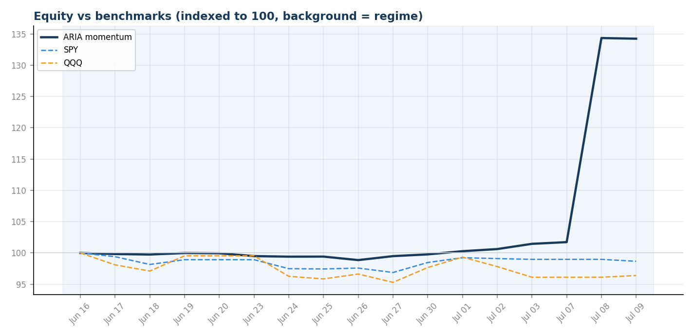
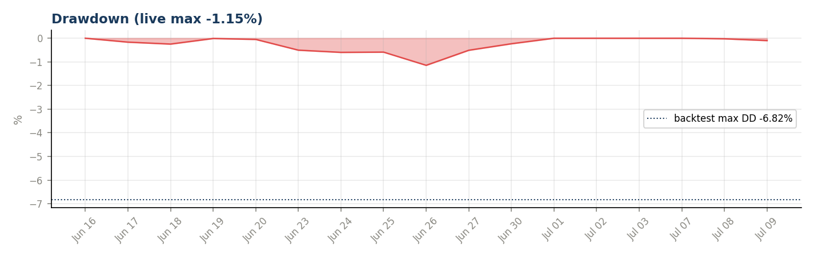
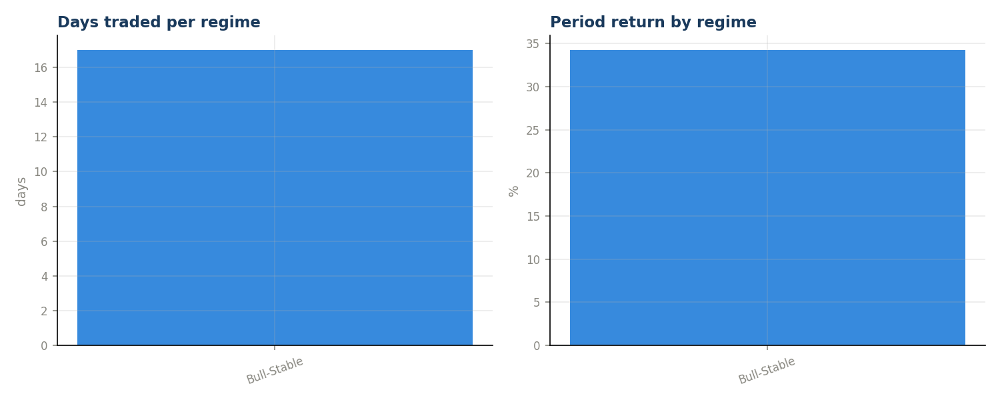
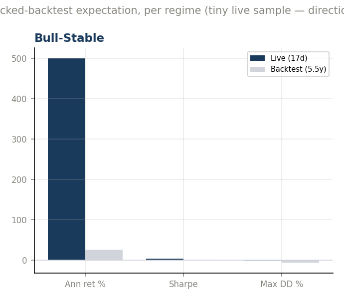
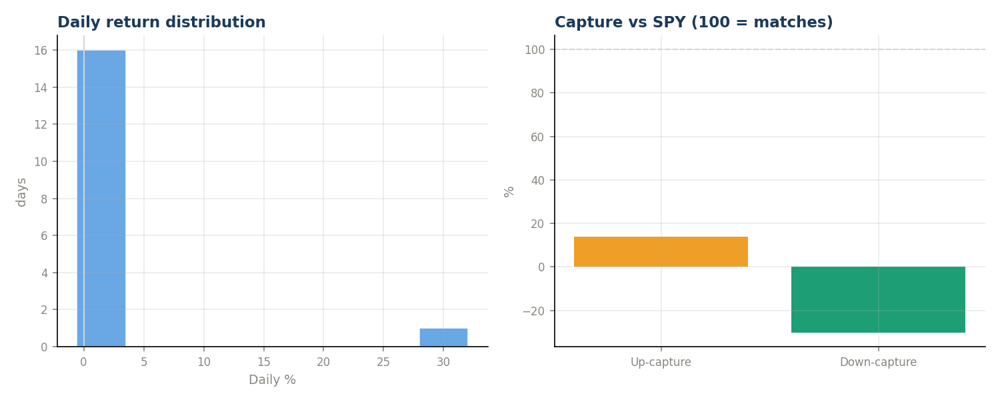
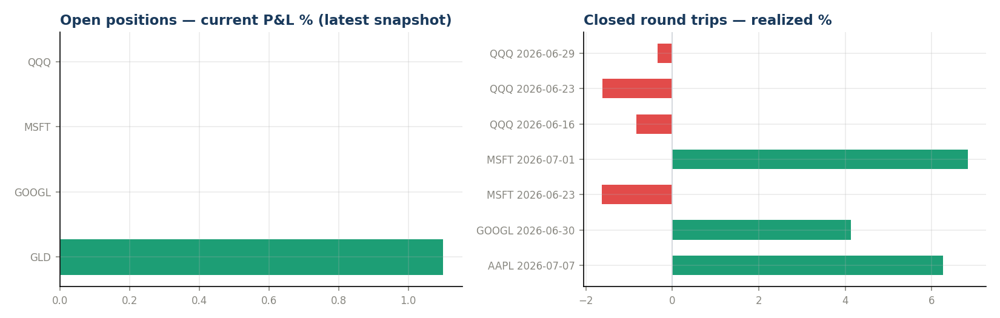
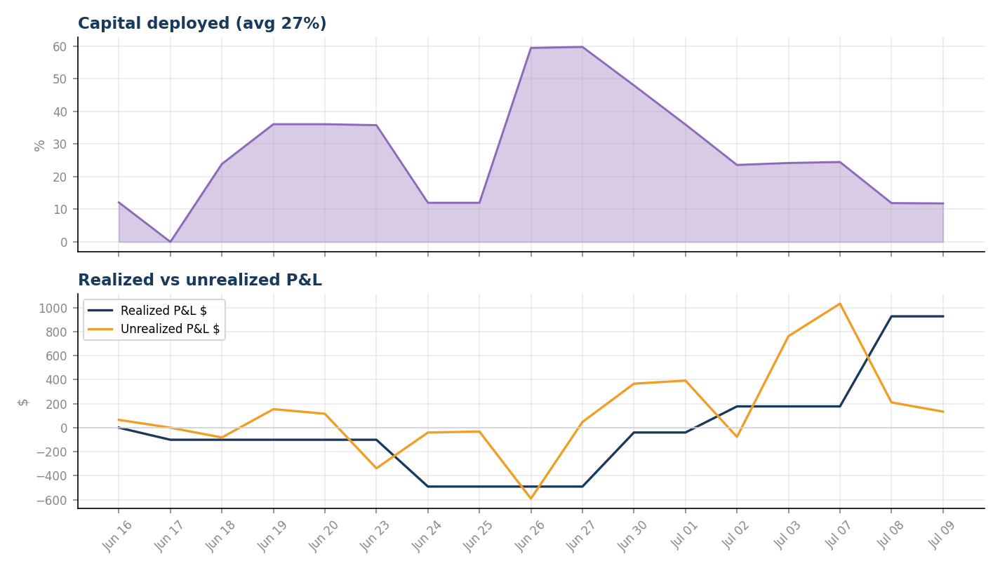

# ARIA-Momentum — Month-End Review 2026-07

_Generated 2026-07-09 12:15 · inception 2026-06-16 → 2026-07-09 · 17 trading days · read-only analysis._

> **Sample-size caveat:** a few weeks of live data verifies the machinery and shows behavior; it cannot prove or disprove the edge validated over 5.5 backtest years. Every number below is indicative, not conclusive — especially while the book has traded in only 1 regime(s).

## Headline
| Metric | Book | SPY | QQQ |
|---|---|---|---|
| Return since inception | **+1.69%** | -1.73% | -4.21% |
| Alpha | — | +3.42pp | +5.91pp |

## Risk-adjusted (annualized from daily — small sample!)
- Sharpe **4.06** · Sortino **189.68** · Calmar 436.25
- Ann. return +499.6% · ann. vol 123.1% · max drawdown **-1.15%** (backtest budget -6.82%)
- Beta vs SPY 0.12 (corr 0.24) · up-capture 14% · down-capture -30%
- Hit rate 56% (9W/7L) · best day +32.05% · worst -0.56%
- Avg capital deployed 27%

## Regime attribution  *(signature)*
| Regime | Days | Period ret | Ann ret | Sharpe | Max DD | Hit |
|---|---|---|---|---|---|---|
| Bull-Stable | 17 | +34.23% | +499.6% | 4.06 | -1.15% | 56% |

## Backtest parity  *(signature)*
_Live per-regime vs the locked 95.55% backtest's expectation for the same regime. With days this few, read direction, not magnitude._

| Regime | Live days | Live ann | BT ann | Live Sharpe | BT Sharpe | Live DD | BT DD |
|---|---|---|---|---|---|---|---|
| Bull-Stable | 17 | +499.6% | +26.2% | 4.06 | 1.33 | -1.15% | -6.72% |

## Trades
7 closed round trips: 3W / 4L. Losers avg hold 3.8d (fast loser exits = min-hold design working). Winners avg hold 9.7d. Note: min-hold HOLD events (skipped sells on profitable young positions) print to console but are not CSV-logged, so churn AVOIDED is not directly countable here.

| Ticker | Entry | Exit | Hold | Realized % | Realized $ | Exit regime |
|---|---|---|---|---|---|---|
| AAPL | 2026-06-18 | 2026-07-07 | 19d | +6.26% | $+750.41 | Bull-Stable |
| GOOGL | 2026-06-25 | 2026-06-30 | 5d | +4.13% | $+490.48 | Bull-Stable |
| MSFT | 2026-06-18 | 2026-06-23 | 5d | -1.63% | $-195.34 | Bull-Stable |
| MSFT | 2026-06-26 | 2026-07-01 | 5d | +6.85% | $+217.38 | Bull-Stable |
| QQQ | 2026-06-15 | 2026-06-16 | 1d | -0.84% | $-100.76 | Bull-Stable |
| QQQ | 2026-06-18 | 2026-06-23 | 5d | -1.63% | $-194.58 | Bull-Stable |
| QQQ | 2026-06-25 | 2026-06-29 | 4d | -0.34% | $-39.97 | Bull-Stable |

## Open book
| Ticker | Entry | Entry px | Shares | Cost | Current P&L % |
|---|---|---|---|---|---|
| GLD | 2026-06-26 | $370.12 | 32.0634 | $11,867 | +1.1% |
| GOOGL | 2026-06-25 | $339.39 | 0.0000 | $0 | n/a |
| MSFT | 2026-06-26 | $352.85 | 24.6330 | $8,692 | n/a |
| QQQ | 2026-06-25 | $712.85 | 0.0000 | $0 | n/a |

## ⚠ Data cross-check flags
daily_history vs live_equity_curve equity mismatches (> $1):
- 2026-06-16: history $100,064.90 vs curve $99,899.23 (Δ $165.67)
- 2026-06-18: history $99,817.36 vs curve $99,732.61 (Δ $84.75)
- 2026-06-23: history $99,560.16 vs curve $99,732.53 (Δ $172.37)
- 2026-06-25: history $99,477.26 vs curve $98,858.00 (Δ $619.26)
- 2026-06-26: history $98,919.05 vs curve $98,894.17 (Δ $24.88)
- 2026-06-30: history $99,831.52 vs curve $99,885.48 (Δ $53.96)
- 2026-07-01: history $100,339.78 vs curve $100,835.23 (Δ $495.45)
- 2026-07-08: history $101,769.03 vs curve $101,779.29 (Δ $10.26)

## Charts

