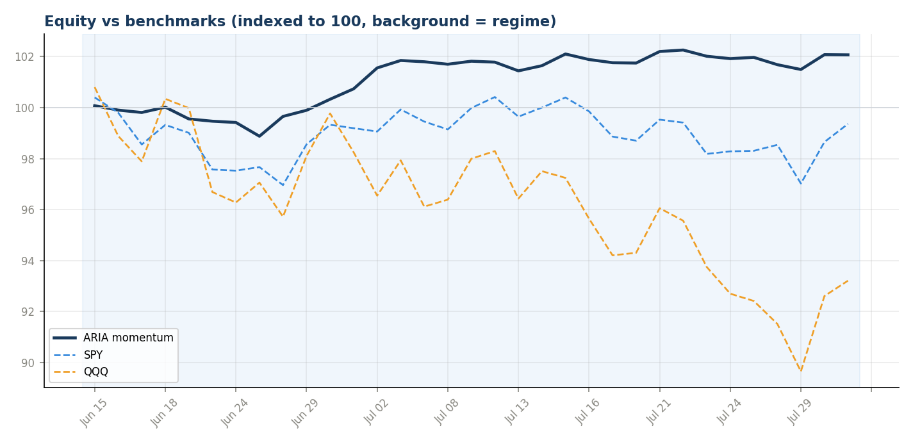
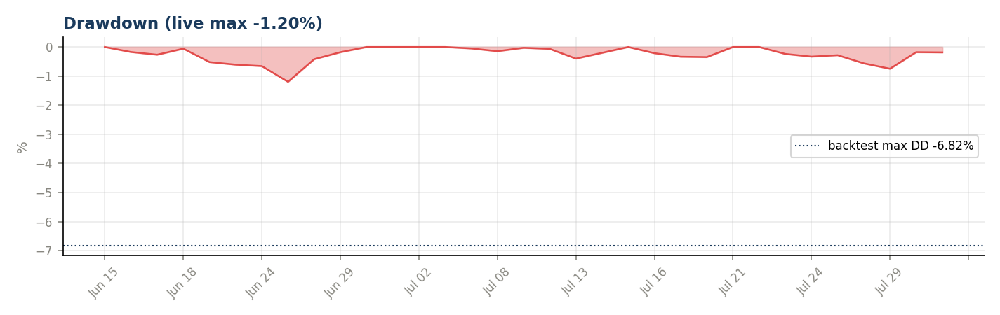
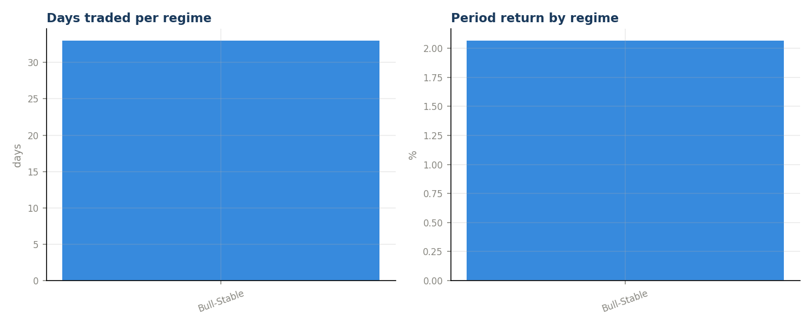
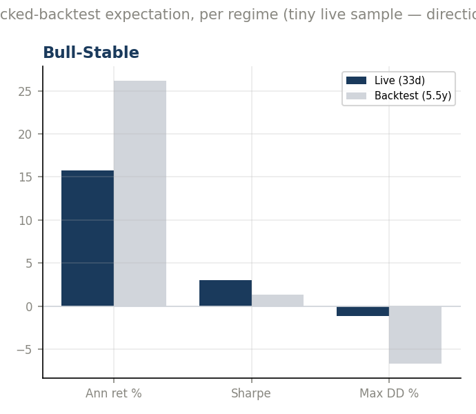
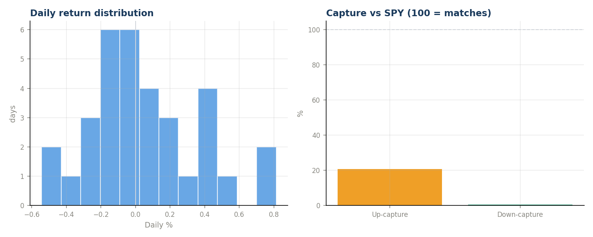
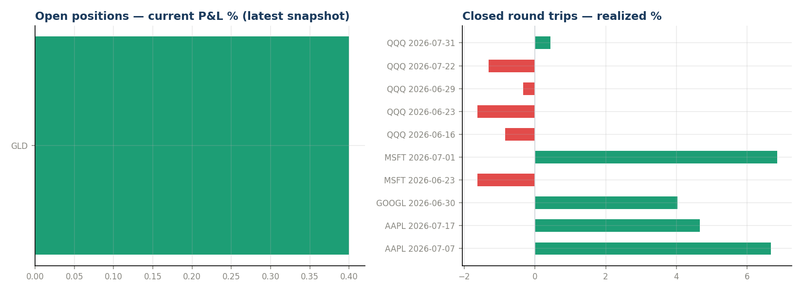
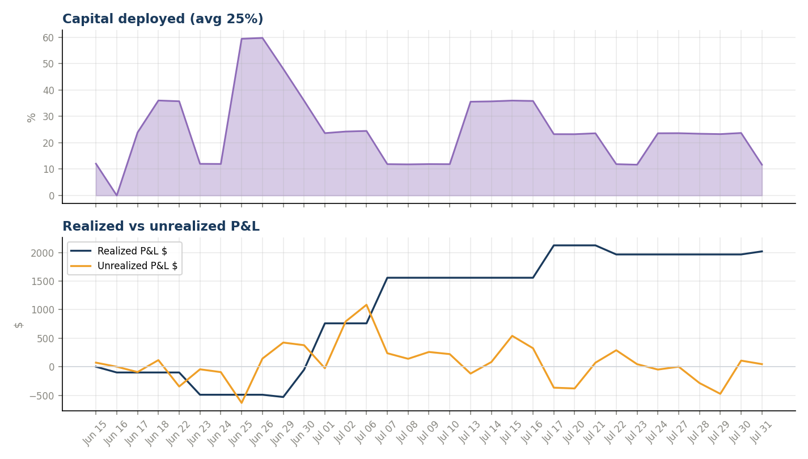
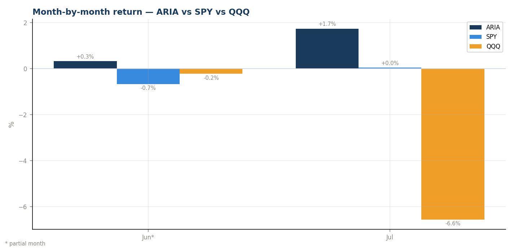
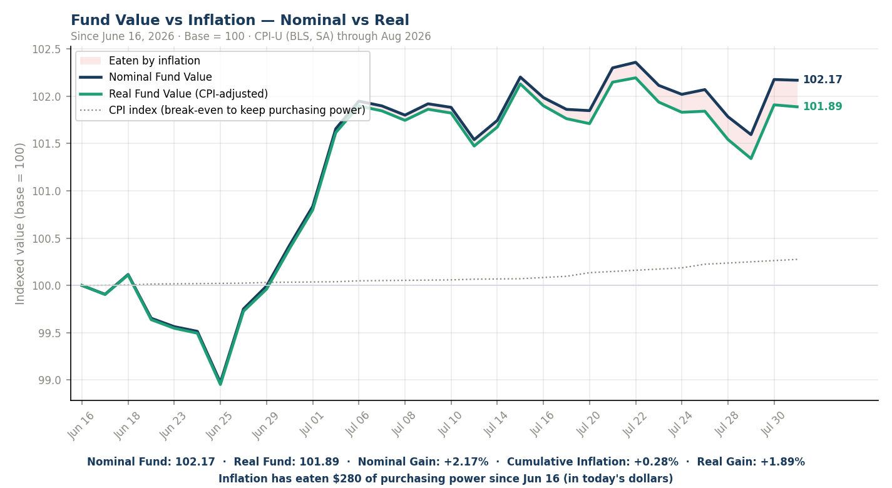

# ARIA-Momentum — Month-End Review 2026-07

_Generated 2026-10-01 11:57 · inception 2026-06-15 → 2026-07-31 · 33 trading days · read-only analysis._

> **Sample-size caveat:** a few weeks of live data verifies the machinery and shows behavior; it cannot prove or disprove the edge validated over 5.5 backtest years. Every number below is indicative, not conclusive — especially while the book has traded in only 1 regime(s).

## Headline
| Metric | Book | SPY | QQQ |
|---|---|---|---|
| Return since inception | **+2.07%** | -0.64% | -6.79% |
| Alpha | — | +2.71pp | +8.86pp |

## Month-by-month
| Month | Days | ARIA | SPY | QQQ | vs SPY | vs QQQ |
|---|---|---|---|---|---|---|
| Jun 2026* | 11 | +0.32% | -0.68% | -0.23% | +1.00pp | +0.56pp |
| Jul 2026 | 22 | +1.74% | +0.03% | -6.57% | +1.70pp | +8.31pp |

_* partial month (first month starts at the 2026-06-15 go-live; a month still running in New York is partial through its latest closed trading day)._

## Inflation — nominal vs real
_Base 2026-06-16 = 100 for fund, real fund and CPI. Real = nominal ÷ cumulative CPI factor (exact, not nominal − inflation). CPI-U (BLS, seasonally adjusted, FRED CPIAUCSL) through the Aug 2026 print; monthly prints anchored mid-month and interpolated geometrically._

| Nominal Fund | Real Fund | Nominal Gain | Cumulative Inflation | Real Gain | Inflation drag |
|---|---|---|---|---|---|
| **102.17** | **101.89** | +2.17% | +0.28% (2.3% annualized) | **+1.89%** | $280.48 |

Month-end snapshots (full per-day series in `inflation_real_value.csv`):

| Date | Nominal | Real | Cum. inflation | Nominal ret | Real ret | CPI |
|---|---|---|---|---|---|---|
| 2026-06-30 | 100.43 | 100.39 | +0.03% | +0.43% | +0.39% | actual |
| 2026-07-31 | 102.17 | 101.89 | +0.28% | +2.17% | +1.89% | actual |

## Risk-adjusted (over the 33 trading days — not annualized)
_Sharpe, Sortino, Calmar and volatility are measured over the 33 trading days actually traded (rf = 0). The only annualized figure is **Ann. return**, an EXTRAPOLATION: the period return compounded to 252 trading days, i.e. what a full year would look like if this pace held — a projection, not a measurement._

- Period return **+2.07%** · period volatility 1.87% · max drawdown **-1.20%** (backtest budget -6.82%)
- Sharpe **1.10** · Sortino **2.15** · Calmar 1.73
- Ann. return (extrapolated) +16.9%
- Beta vs SPY 0.18 (corr 0.43) · up-capture 21% · down-capture 1%
- Hit rate 45% (15W/18L) · best day +0.81% · worst -0.54%
- Avg capital deployed 25%

## Regime attribution  *(signature)*
| Regime | Days | Period ret | Ann ret (extrap.) | Sharpe (period) | Max DD | Hit |
|---|---|---|---|---|---|---|
| Bull-Stable | 33 | +2.07% | +16.9% | 1.10 | -1.20% | 45% |

## Backtest parity  *(signature)*
_Live per-regime vs the locked 95.55% backtest's expectation for the same regime. With days this few, read direction, not magnitude. Live ann. return is extrapolated from the live days. Live Sharpe covers only the live days, so the backtest's annual Sharpe is scaled to the same horizon (× √(days/252)) to compare like with like._

| Regime | Live days | Live ann (extrap.) | BT ann | Live Sharpe | BT Sharpe, same horizon (annual) | Live DD | BT DD |
|---|---|---|---|---|---|---|---|
| Bull-Stable | 33 | +16.9% | +26.2% | 1.10 | 0.48 (1.33) | -1.20% | -6.72% |

## Trades
10 closed round trips: 5W / 5L. Losers avg hold 5.0d (fast loser exits = min-hold design working). Winners avg hold 8.4d. Note: min-hold HOLD events (skipped sells on profitable young positions) print to console but are not CSV-logged, so churn AVOIDED is not directly countable here.

| Ticker | Entry | Exit | Hold | Realized % | Realized $ | Exit regime |
|---|---|---|---|---|---|---|
| AAPL | 2026-06-17 | 2026-07-07 | 20d | +6.66% | $+798.86 | Bull-Stable |
| AAPL | 2026-07-13 | 2026-07-17 | 4d | +4.66% | $+567.02 | Bull-Stable |
| GOOGL | 2026-06-25 | 2026-06-30 | 5d | +4.03% | $+478.25 | Bull-Stable |
| MSFT | 2026-06-17 | 2026-06-23 | 6d | -1.63% | $-195.34 | Bull-Stable |
| MSFT | 2026-06-25 | 2026-07-01 | 6d | +6.85% | $+812.36 | Bull-Stable |
| QQQ | 2026-06-15 | 2026-06-16 | 1d | -0.84% | $-100.76 | Bull-Stable |
| QQQ | 2026-06-18 | 2026-06-23 | 5d | -1.63% | $-194.58 | Bull-Stable |
| QQQ | 2026-06-25 | 2026-06-29 | 4d | -0.34% | $-39.97 | Bull-Stable |
| QQQ | 2026-07-13 | 2026-07-22 | 9d | -1.30% | $-158.87 | Bull-Stable |
| QQQ | 2026-07-24 | 2026-07-31 | 7d | +0.44% | $+53.74 | Bull-Stable |

## Open book
| Ticker | Entry | Entry px | Shares | Cost | Current P&L % |
|---|---|---|---|---|---|
| GLD | 2026-06-25 | $370.12 | 32.0634 | $11,867 | +0.4% |

## Charts

