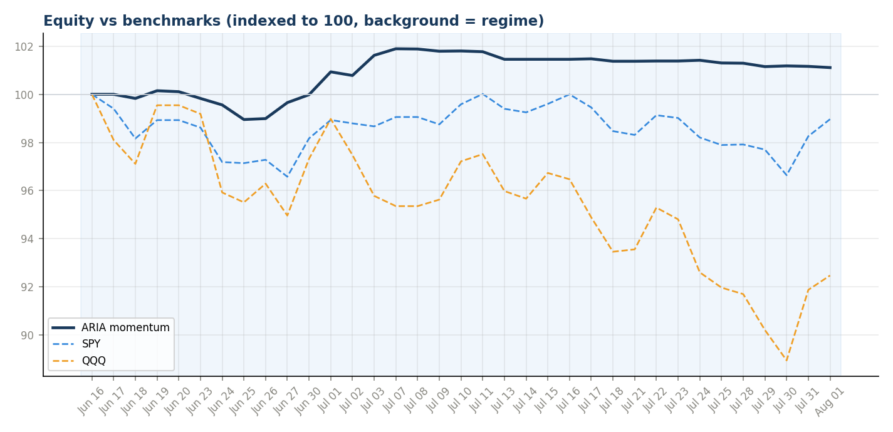
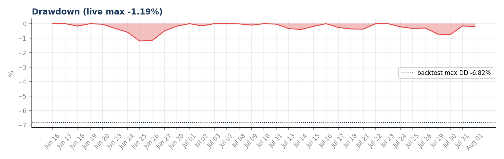
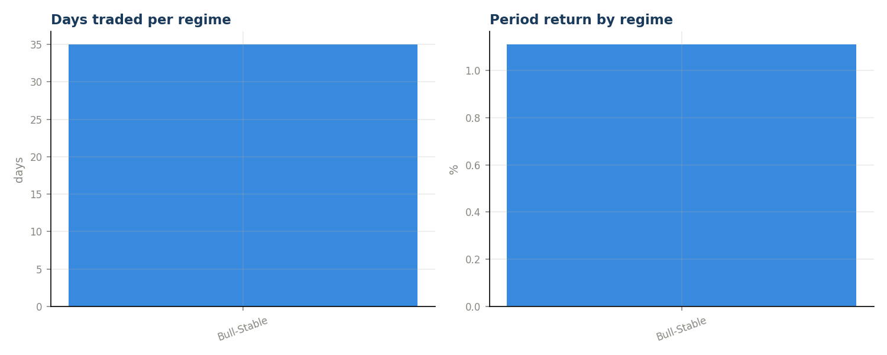
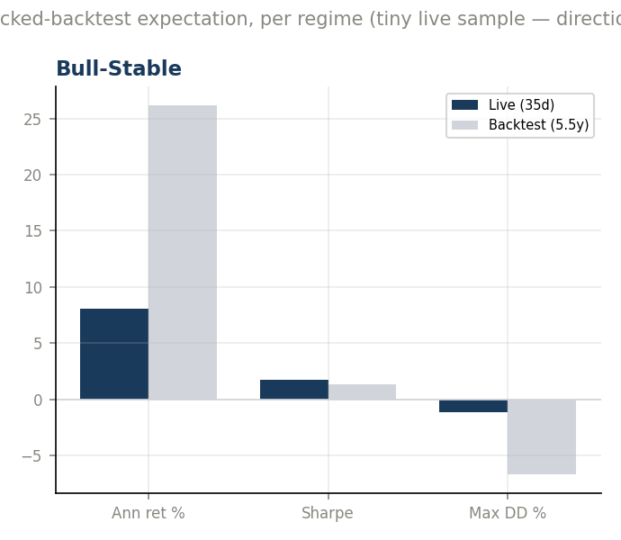
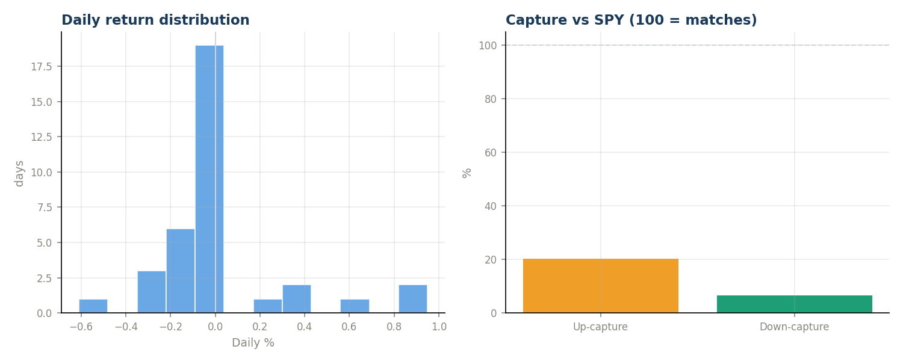
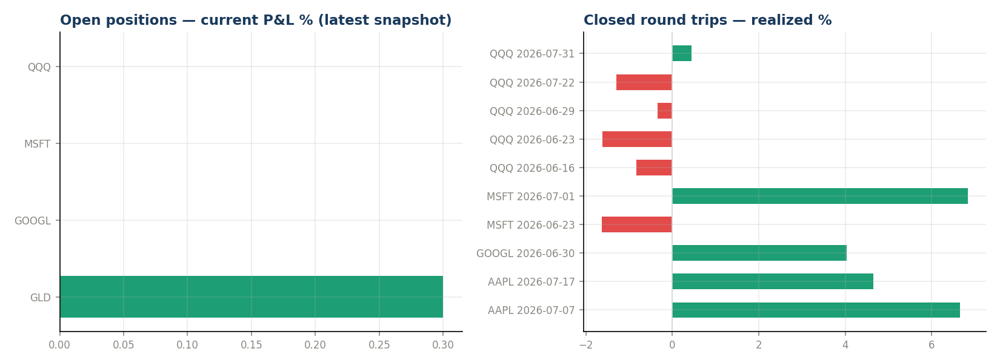
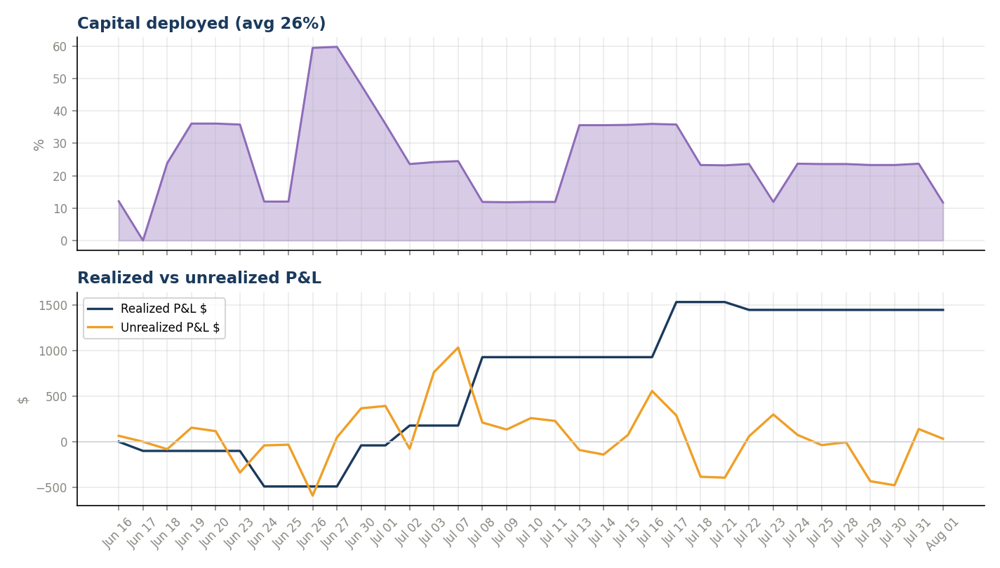

# ARIA-Momentum — Month-End Review 2026-08

_Generated 2026-08-01 18:47 · inception 2026-06-16 → 2026-08-01 · 35 trading days · read-only analysis._

> **Sample-size caveat:** a few weeks of live data verifies the machinery and shows behavior; it cannot prove or disprove the edge validated over 5.5 backtest years. Every number below is indicative, not conclusive — especially while the book has traded in only 1 regime(s).

## Headline
| Metric | Book | SPY | QQQ |
|---|---|---|---|
| Return since inception | **+2.05%** | -1.03% | -7.53% |
| Alpha | — | +3.08pp | +9.58pp |

## Risk-adjusted (annualized from daily — small sample!)
- Sharpe **1.70** · Sortino **3.95** · Calmar 6.75
- Ann. return +8.1% · ann. vol 4.7% · max drawdown **-1.19%** (backtest budget -6.82%)
- Beta vs SPY 0.12 (corr 0.28) · up-capture 20% · down-capture 7%
- Hit rate 43% (12W/16L) · best day +0.95% · worst -0.61%
- Avg capital deployed 26%

## Regime attribution  *(signature)*
| Regime | Days | Period ret | Ann ret | Sharpe | Max DD | Hit |
|---|---|---|---|---|---|---|
| Bull-Stable | 35 | +1.11% | +8.1% | 1.70 | -1.19% | 43% |

## Backtest parity  *(signature)*
_Live per-regime vs the locked 95.55% backtest's expectation for the same regime. With days this few, read direction, not magnitude._

| Regime | Live days | Live ann | BT ann | Live Sharpe | BT Sharpe | Live DD | BT DD |
|---|---|---|---|---|---|---|---|
| Bull-Stable | 35 | +8.1% | +26.2% | 1.70 | 1.33 | -1.19% | -6.72% |

## Trades
10 closed round trips: 5W / 5L. Losers avg hold 4.8d (fast loser exits = min-hold design working). Winners avg hold 8.0d. Note: min-hold HOLD events (skipped sells on profitable young positions) print to console but are not CSV-logged, so churn AVOIDED is not directly countable here.

| Ticker | Entry | Exit | Hold | Realized % | Realized $ | Exit regime |
|---|---|---|---|---|---|---|
| AAPL | 2026-06-18 | 2026-07-07 | 19d | +6.66% | $+798.86 | Bull-Stable |
| AAPL | 2026-07-13 | 2026-07-17 | 4d | +4.66% | $+567.02 | Bull-Stable |
| GOOGL | 2026-06-25 | 2026-06-30 | 5d | +4.03% | $+478.25 | Bull-Stable |
| MSFT | 2026-06-18 | 2026-06-23 | 5d | -1.63% | $-195.34 | Bull-Stable |
| MSFT | 2026-06-26 | 2026-07-01 | 5d | +6.85% | $+812.36 | Bull-Stable |
| QQQ | 2026-06-15 | 2026-06-16 | 1d | -0.84% | $-100.76 | Bull-Stable |
| QQQ | 2026-06-18 | 2026-06-23 | 5d | -1.63% | $-194.58 | Bull-Stable |
| QQQ | 2026-06-25 | 2026-06-29 | 4d | -0.34% | $-39.97 | Bull-Stable |
| QQQ | 2026-07-13 | 2026-07-22 | 9d | -1.30% | $-158.87 | Bull-Stable |
| QQQ | 2026-07-24 | 2026-07-31 | 7d | +0.44% | $+53.74 | Bull-Stable |

## Open book
| Ticker | Entry | Entry px | Shares | Cost | Current P&L % |
|---|---|---|---|---|---|
| GLD | 2026-06-26 | $370.12 | 32.0634 | $11,867 | +0.3% |
| GOOGL | 2026-06-25 | $339.39 | 0.0000 | $0 | n/a |
| MSFT | 2026-06-26 | $352.85 | 0.0000 | $0 | n/a |
| QQQ | 2026-07-24 | $690.25 | 0.0000 | $0 | n/a |

## Charts

