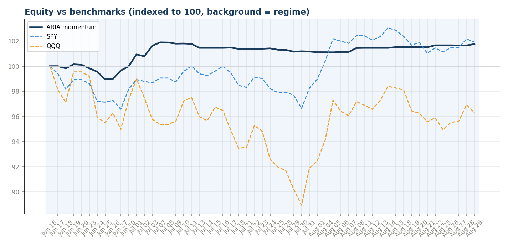
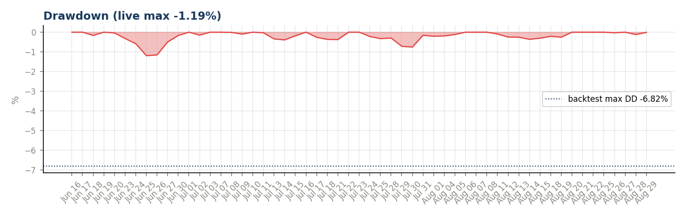
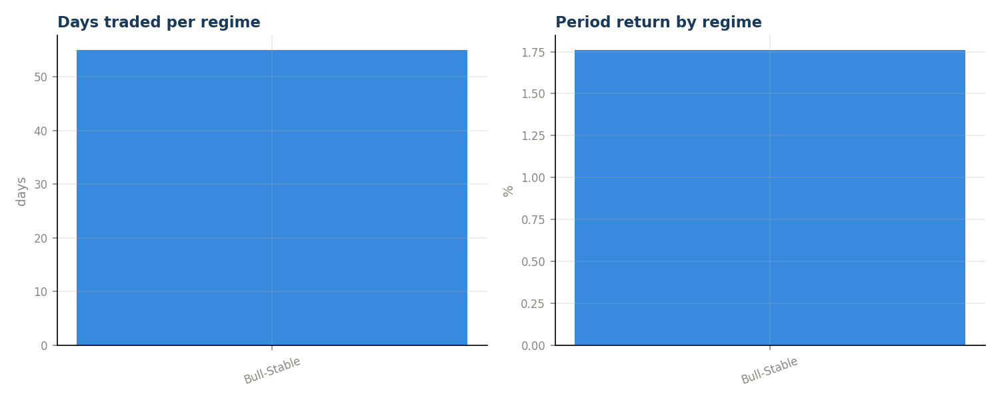
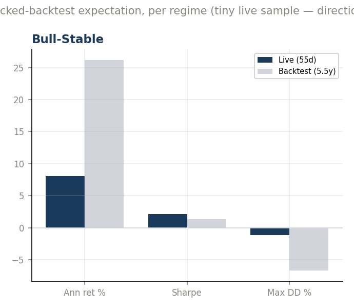
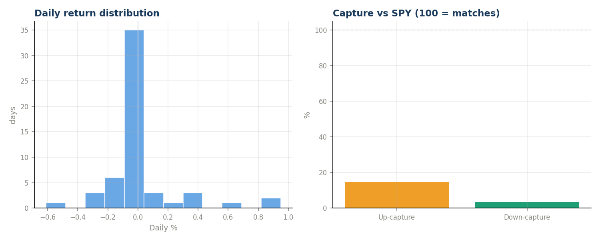
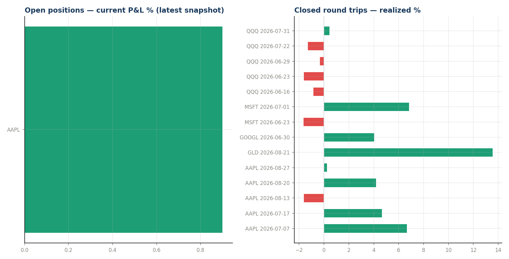
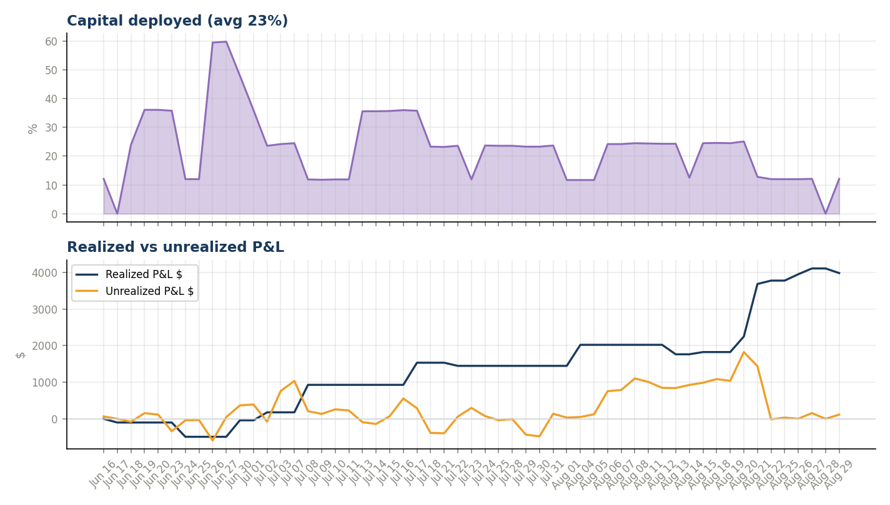
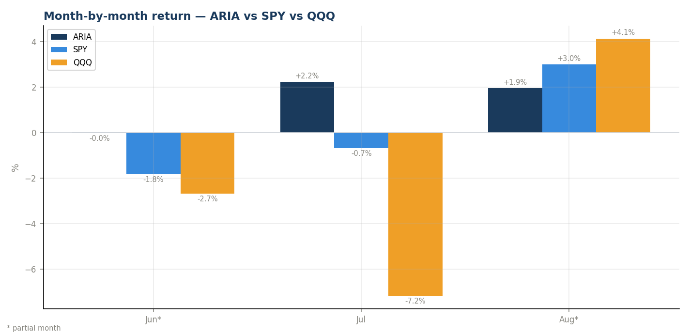
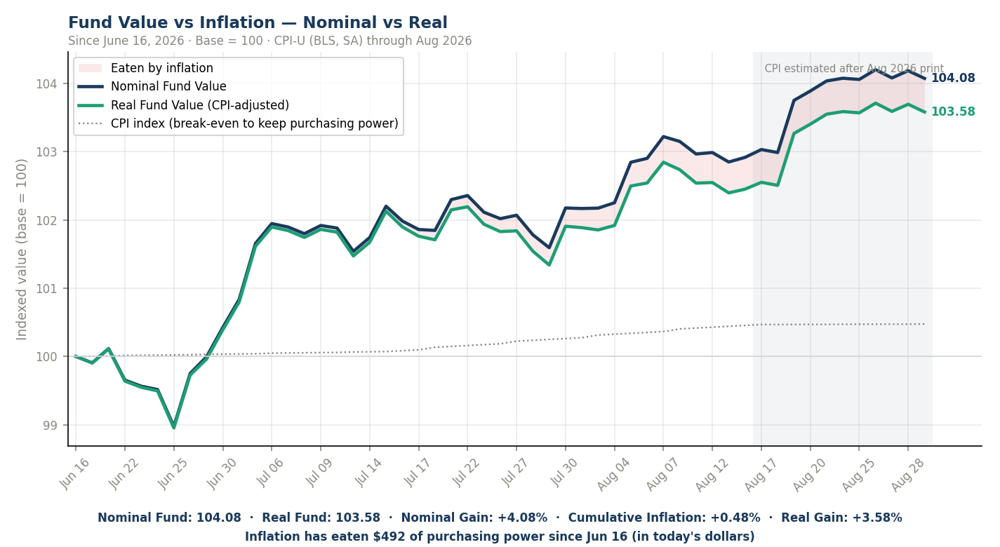

# ARIA-Momentum — Month-End Review 2026-08

_Generated 2026-10-01 11:43 · inception 2026-06-15 → 2026-08-31 · 54 trading days · read-only analysis._

> **Sample-size caveat:** a few weeks of live data verifies the machinery and shows behavior; it cannot prove or disprove the edge validated over 5.5 backtest years. Every number below is indicative, not conclusive — especially while the book has traded in only 1 regime(s).

## Headline
| Metric | Book | SPY | QQQ |
|---|---|---|---|
| Return since inception | **+3.97%** | +2.02% | -2.89% |
| Alpha | — | +1.95pp | +6.86pp |

## Month-by-month
| Month | Days | ARIA | SPY | QQQ | vs SPY | vs QQQ |
|---|---|---|---|---|---|---|
| Jun 2026* | 11 | +0.32% | -0.68% | -0.23% | +1.00pp | +0.56pp |
| Jul 2026 | 22 | +1.74% | +0.03% | -6.57% | +1.70pp | +8.31pp |
| Aug 2026 | 21 | +1.87% | +2.68% | +4.18% | -0.81pp | -2.32pp |

_* partial month (first month starts at the 2026-06-15 go-live; a month still running in New York is partial through its latest closed trading day)._

## Inflation — nominal vs real
_Base 2026-06-16 = 100 for fund, real fund and CPI. Real = nominal ÷ cumulative CPI factor (exact, not nominal − inflation). CPI-U (BLS, seasonally adjusted, FRED CPIAUCSL) through the Aug 2026 print; monthly prints anchored mid-month and interpolated geometrically, later days extrapolated at the trailing 3-month pace (estimate)._

| Nominal Fund | Real Fund | Nominal Gain | Cumulative Inflation | Real Gain | Inflation drag |
|---|---|---|---|---|---|
| **104.08** | **103.58** | +4.08% | +0.48% (2.3% annualized) | **+3.58%** | $492.01 |

Month-end snapshots (full per-day series in `inflation_real_value.csv`):

| Date | Nominal | Real | Cum. inflation | Nominal ret | Real ret | CPI |
|---|---|---|---|---|---|---|
| 2026-06-30 | 100.43 | 100.39 | +0.03% | +0.43% | +0.39% | actual |
| 2026-07-31 | 102.17 | 101.89 | +0.28% | +2.17% | +1.89% | actual |
| 2026-08-31 | 104.08 | 103.58 | +0.48% | +4.08% | +3.58% | est. |

## Risk-adjusted (annualized from daily — small sample!)
- Sharpe **3.99** · Sortino **9.73** · Calmar 15.30
- Ann. return +18.3% · ann. vol 4.6% · max drawdown **-1.20%** (backtest budget -6.82%)
- Beta vs SPY 0.12 (corr 0.31) · up-capture 20% · down-capture -4%
- Hit rate 54% (29W/25L) · best day +0.81% · worst -0.54%
- Avg capital deployed 22%

## Regime attribution  *(signature)*
| Regime | Days | Period ret | Ann ret | Sharpe | Max DD | Hit |
|---|---|---|---|---|---|---|
| Bull-Stable | 54 | +3.97% | +18.3% | 3.99 | -1.20% | 54% |

## Backtest parity  *(signature)*
_Live per-regime vs the locked 95.55% backtest's expectation for the same regime. With days this few, read direction, not magnitude._

| Regime | Live days | Live ann | BT ann | Live Sharpe | BT Sharpe | Live DD | BT DD |
|---|---|---|---|---|---|---|---|
| Bull-Stable | 54 | +18.3% | +26.2% | 3.99 | 1.33 | -1.20% | -6.72% |

## Trades
14 closed round trips: 8W / 6L. Losers avg hold 5.5d (fast loser exits = min-hold design working). Winners avg hold 13.9d. Note: min-hold HOLD events (skipped sells on profitable young positions) print to console but are not CSV-logged, so churn AVOIDED is not directly countable here.

| Ticker | Entry | Exit | Hold | Realized % | Realized $ | Exit regime |
|---|---|---|---|---|---|---|
| AAPL | 2026-06-17 | 2026-07-07 | 20d | +6.66% | $+798.86 | Bull-Stable |
| AAPL | 2026-07-13 | 2026-07-17 | 4d | +4.66% | $+567.02 | Bull-Stable |
| AAPL | 2026-08-05 | 2026-08-13 | 8d | -1.61% | $-197.89 | Bull-Stable |
| AAPL | 2026-08-14 | 2026-08-20 | 6d | +4.19% | $+517.00 | Bull-Stable |
| AAPL | 2026-08-21 | 2026-08-27 | 6d | +0.25% | $+31.26 | Bull-Stable |
| GLD | 2026-06-25 | 2026-08-21 | 57d | +13.55% | $+1,608.26 | Bull-Stable |
| GOOGL | 2026-06-25 | 2026-06-30 | 5d | +4.03% | $+478.25 | Bull-Stable |
| MSFT | 2026-06-17 | 2026-06-23 | 6d | -1.63% | $-195.34 | Bull-Stable |
| MSFT | 2026-06-25 | 2026-07-01 | 6d | +6.85% | $+812.36 | Bull-Stable |
| QQQ | 2026-06-15 | 2026-06-16 | 1d | -0.84% | $-100.76 | Bull-Stable |
| QQQ | 2026-06-18 | 2026-06-23 | 5d | -1.63% | $-194.58 | Bull-Stable |
| QQQ | 2026-06-25 | 2026-06-29 | 4d | -0.34% | $-39.97 | Bull-Stable |
| QQQ | 2026-07-13 | 2026-07-22 | 9d | -1.30% | $-158.87 | Bull-Stable |
| QQQ | 2026-07-24 | 2026-07-31 | 7d | +0.44% | $+53.74 | Bull-Stable |

## Open book
| Ticker | Entry | Entry px | Shares | Cost | Current P&L % |
|---|---|---|---|---|---|
| AAPL | 2026-08-28 | $317.02 | 39.3583 | $12,477 | -0.1% |

## Charts

