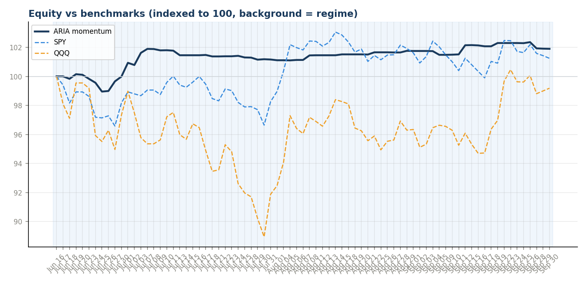
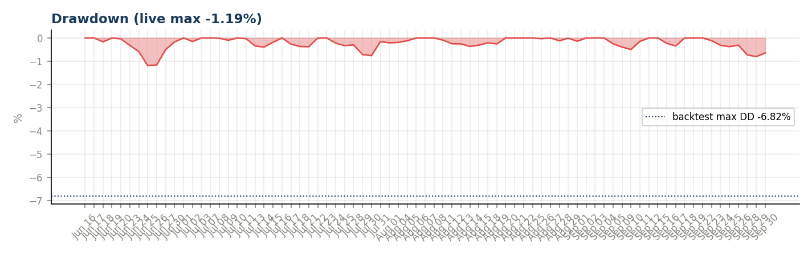
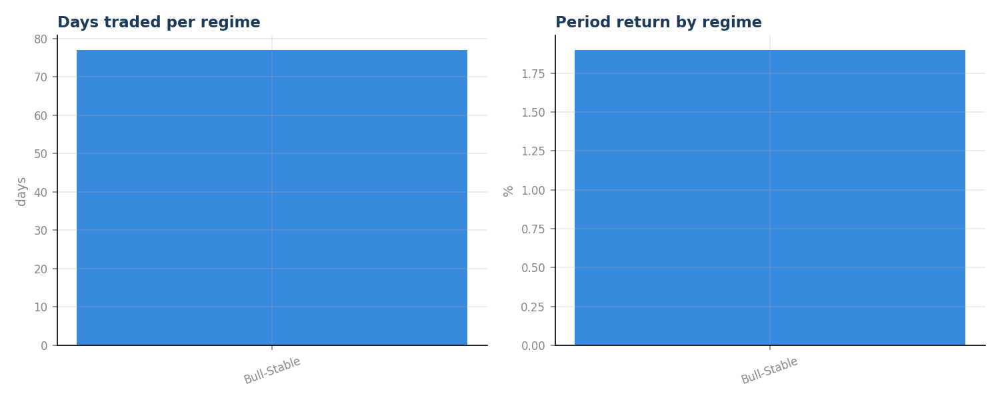
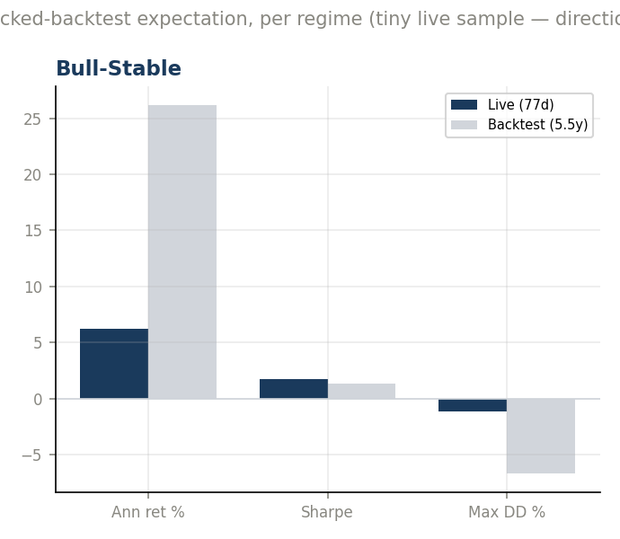
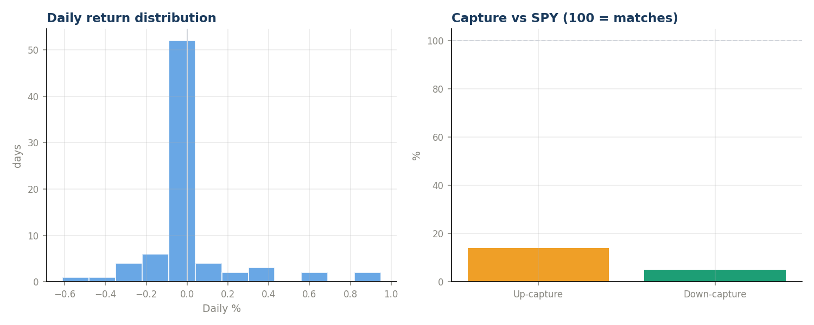
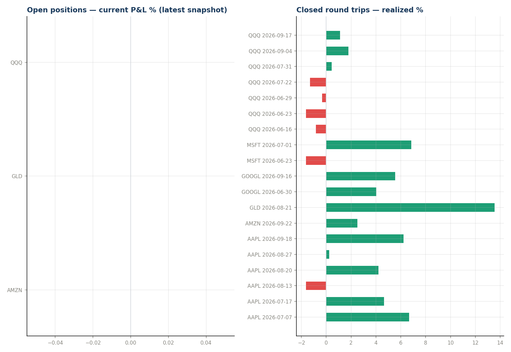
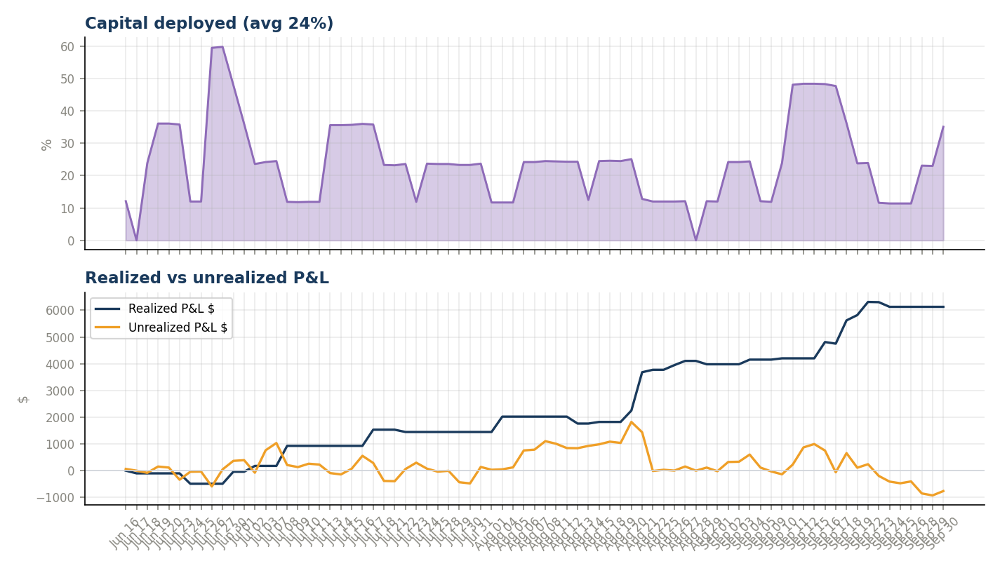
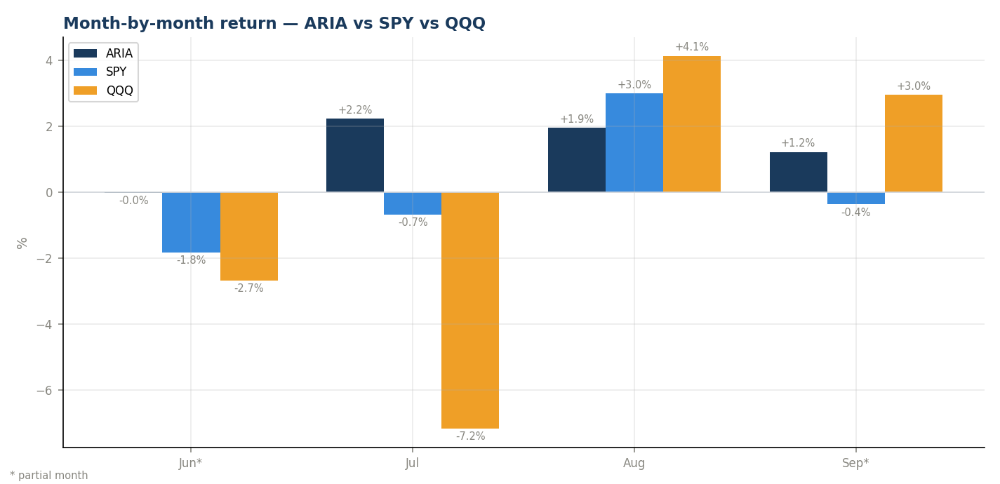
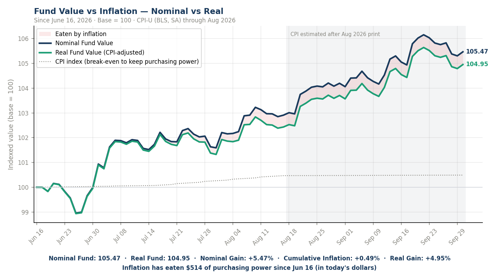

# ARIA-Momentum — Month-End Review 2026-09

_Generated 2026-09-30 20:14 · inception 2026-06-16 → 2026-09-30 · 77 trading days · read-only analysis._

> **Sample-size caveat:** a few weeks of live data verifies the machinery and shows behavior; it cannot prove or disprove the edge validated over 5.5 backtest years. Every number below is indicative, not conclusive — especially while the book has traded in only 1 regime(s).

## Headline
| Metric | Book | SPY | QQQ |
|---|---|---|---|
| Return since inception | **+5.36%** | +1.24% | -0.82% |
| Alpha | — | +4.12pp | +6.18pp |

## Month-by-month
| Month | Days | ARIA | SPY | QQQ | vs SPY | vs QQQ |
|---|---|---|---|---|---|---|
| Jun 2026* | 11 | -0.01% | -1.83% | -2.68% | +1.82pp | +2.66pp |
| Jul 2026 | 23 | +2.22% | -0.68% | -7.18% | +2.90pp | +9.40pp |
| Aug 2026 | 21 | +1.95% | +2.99% | +4.13% | -1.04pp | -2.19pp |
| Sep 2026* | 22 | +1.22% | -0.37% | +2.95% | +1.59pp | -1.73pp |

_* partial month (from 2026-06-16 go-live; current month is partial too, through the latest logged row)._

## Inflation — nominal vs real
_Base 2026-06-16 = 100 for fund, real fund and CPI. Real = nominal ÷ cumulative CPI factor (exact, not nominal − inflation). CPI-U (BLS, seasonally adjusted, FRED CPIAUCSL) through the Aug 2026 print; monthly prints anchored mid-month and interpolated geometrically, later days extrapolated at the trailing 3-month pace (estimate)._

| Nominal Fund | Real Fund | Nominal Gain | Cumulative Inflation | Real Gain | Inflation drag |
|---|---|---|---|---|---|
| **105.47** | **104.95** | +5.47% | +0.49% (1.7% annualized) | **+4.95%** | $514.15 |

Month-end snapshots (full per-day series in `inflation_real_value.csv`):

| Date | Nominal | Real | Cum. inflation | Nominal ret | Real ret | CPI |
|---|---|---|---|---|---|---|
| 2026-06-30 | 99.99 | 99.95 | +0.03% | -0.01% | -0.05% | actual |
| 2026-07-31 | 102.21 | 101.93 | +0.28% | +2.21% | +1.93% | actual |
| 2026-08-29 | 104.20 | 103.71 | +0.47% | +4.20% | +3.71% | est. |
| 2026-09-30 | 105.47 | 104.95 | +0.49% | +5.47% | +4.95% | est. |

## Risk-adjusted (annualized from daily — small sample!)
- Sharpe **1.75** · Sortino **3.74** · Calmar 5.20
- Ann. return +6.2% · ann. vol 3.6% · max drawdown **-1.19%** (backtest budget -6.82%)
- Beta vs SPY 0.09 (corr 0.27) · up-capture 14% · down-capture 5%
- Hit rate 46% (24W/28L) · best day +0.95% · worst -0.61%
- Avg capital deployed 24%

## Regime attribution  *(signature)*
| Regime | Days | Period ret | Ann ret | Sharpe | Max DD | Hit |
|---|---|---|---|---|---|---|
| Bull-Stable | 77 | +1.90% | +6.2% | 1.75 | -1.19% | 46% |

## Backtest parity  *(signature)*
_Live per-regime vs the locked 95.55% backtest's expectation for the same regime. With days this few, read direction, not magnitude._

| Regime | Live days | Live ann | BT ann | Live Sharpe | BT Sharpe | Live DD | BT DD |
|---|---|---|---|---|---|---|---|
| Bull-Stable | 77 | +6.2% | +26.2% | 1.75 | 1.33 | -1.19% | -6.72% |

## Trades
19 closed round trips: 13W / 6L. Losers avg hold 5.3d (fast loser exits = min-hold design working). Winners avg hold 11.6d. Note: min-hold HOLD events (skipped sells on profitable young positions) print to console but are not CSV-logged, so churn AVOIDED is not directly countable here.

| Ticker | Entry | Exit | Hold | Realized % | Realized $ | Exit regime |
|---|---|---|---|---|---|---|
| AAPL | 2026-06-18 | 2026-07-07 | 19d | +6.66% | $+798.86 | Bull-Stable |
| AAPL | 2026-07-13 | 2026-07-17 | 4d | +4.66% | $+567.02 | Bull-Stable |
| AAPL | 2026-08-05 | 2026-08-13 | 8d | -1.61% | $-197.89 | Bull-Stable |
| AAPL | 2026-08-14 | 2026-08-20 | 6d | +4.19% | $+517.00 | Bull-Stable |
| AAPL | 2026-08-21 | 2026-08-27 | 6d | +0.25% | $+31.26 | Bull-Stable |
| AAPL | 2026-08-28 | 2026-09-18 | 21d | +6.23% | $+777.71 | Bull-Stable |
| AMZN | 2026-09-16 | 2026-09-22 | 6d | +2.52% | $+317.16 | Bull-Stable |
| GLD | 2026-06-26 | 2026-08-21 | 56d | +13.55% | $+1,608.26 | Bull-Stable |
| GOOGL | 2026-06-25 | 2026-06-30 | 5d | +4.03% | $+478.25 | Bull-Stable |
| GOOGL | 2026-09-10 | 2026-09-16 | 6d | +5.55% | $+693.32 | Bull-Stable |
| MSFT | 2026-06-18 | 2026-06-23 | 5d | -1.63% | $-195.34 | Bull-Stable |
| MSFT | 2026-06-26 | 2026-07-01 | 5d | +6.85% | $+812.36 | Bull-Stable |
| QQQ | 2026-06-15 | 2026-06-16 | 1d | -0.84% | $-100.76 | Bull-Stable |
| QQQ | 2026-06-18 | 2026-06-23 | 5d | -1.63% | $-194.58 | Bull-Stable |
| QQQ | 2026-06-25 | 2026-06-29 | 4d | -0.34% | $-39.97 | Bull-Stable |
| QQQ | 2026-07-13 | 2026-07-22 | 9d | -1.30% | $-158.87 | Bull-Stable |
| QQQ | 2026-07-24 | 2026-07-31 | 7d | +0.44% | $+53.74 | Bull-Stable |
| QQQ | 2026-09-01 | 2026-09-04 | 3d | +1.78% | $+222.31 | Bull-Stable |
| QQQ | 2026-09-10 | 2026-09-17 | 7d | +1.11% | $+138.00 | Bull-Stable |

## Open book
| Ticker | Entry | Entry px | Shares | Cost | Current P&L % |
|---|---|---|---|---|---|
| AMZN | 2026-09-28 | $247.02 | 51.1498 | $12,635 | n/a |
| GLD | 2026-09-09 | $406.29 | 30.7669 | $12,500 | n/a |
| QQQ | 2026-09-29 | $739.28 | 17.0789 | $12,626 | n/a |

## Charts

