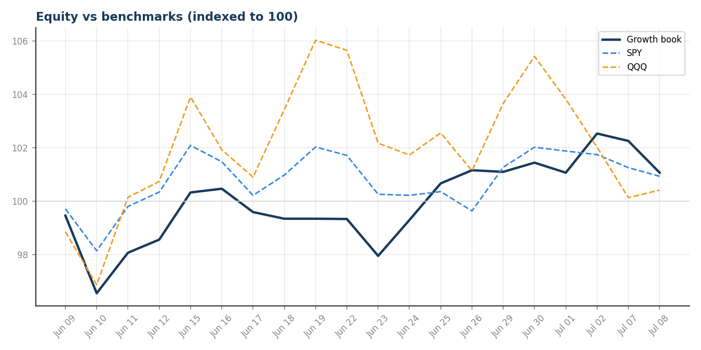
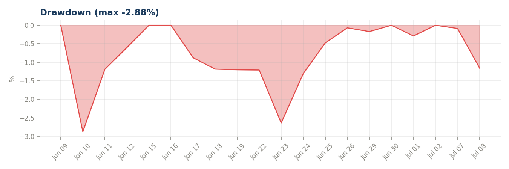
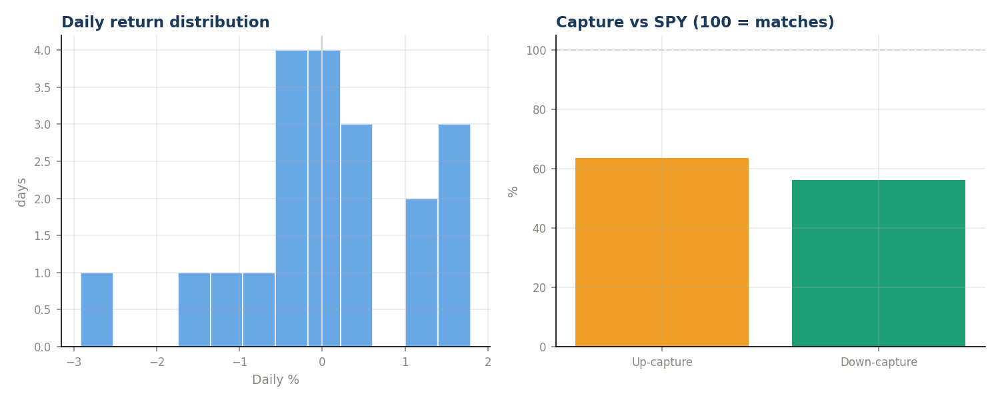
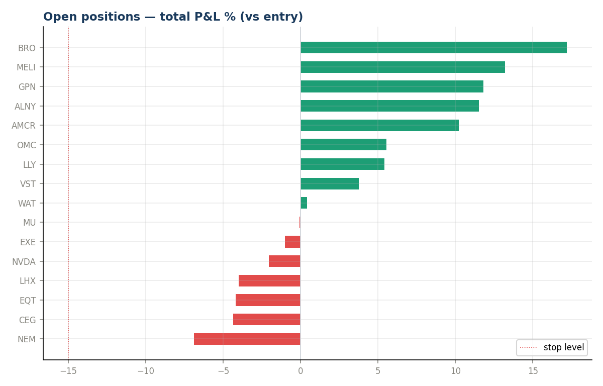
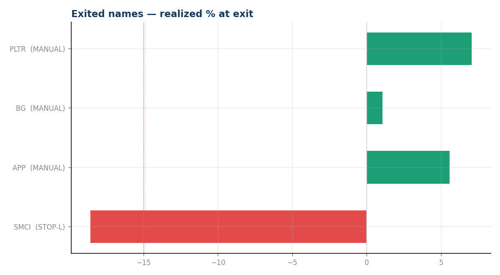

# ARIA-Growth — Month-End Review 2026-07

_Generated 2026-07-09 12:23. Read-only analysis; 20 trading days of data._

> **Sample-size caveat:** one month verifies the machinery and shows behavior; it cannot prove or disprove edge. Treat every number below as indicative, not conclusive.

## Headline
| Metric | Book | SPY | QQQ |
|---|---|---|---|
| Return since go-live | **+1.44%** | +1.11% | +0.51% |
| Alpha | — | +0.33pp | +0.93pp |

## Risk-adjusted (annualized from daily)
- Sharpe: **0.82**   |   Sortino: **1.30**   |   Calmar: 5.21
- Ann. return +15.0%  |  Ann. vol 18.3%  |  Max drawdown -2.88%
- Beta vs SPY 0.79 (corr 0.64)
- Up-capture 64%  |  Down-capture 56%  ← winning by losing less
- Hit rate 47% (9W / 10L)  |  best day +1.79%  worst -2.92%

## Open book
- 16 positions, 9 in profit as of 2026-07-08
- Best: BRO +17.2%  |  Worst: NEM -6.9%
- ⚠ Danger zone (<10pt to stop): NEM

## Exits this period
| Name | Type | Exit date | Realized % |
|---|---|---|---|
| SMCI | STOP-LOSS | 2026-06-10 | -18.59% |
| APP | MANUAL DROP | 2026-06-15 | +5.57% |
| BG | MANUAL DROP | 2026-06-18 | +1.07% |
| PLTR | MANUAL DROP | 2026-06-23 | +7.05% |

1 stop-loss, 3 manual. To grade whether each exit helped, compare the stock's current price to its level at exit (see exits_postmortem.png / px_now column if fetched).

## Charts

