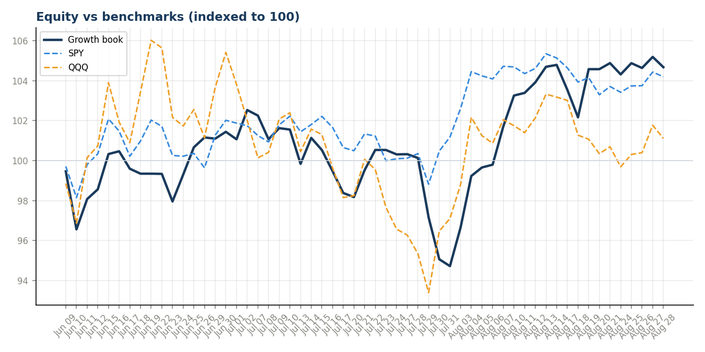
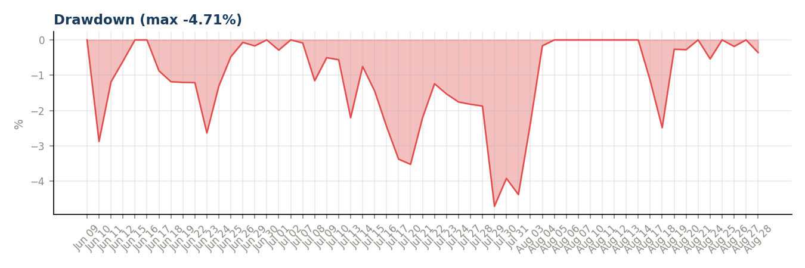
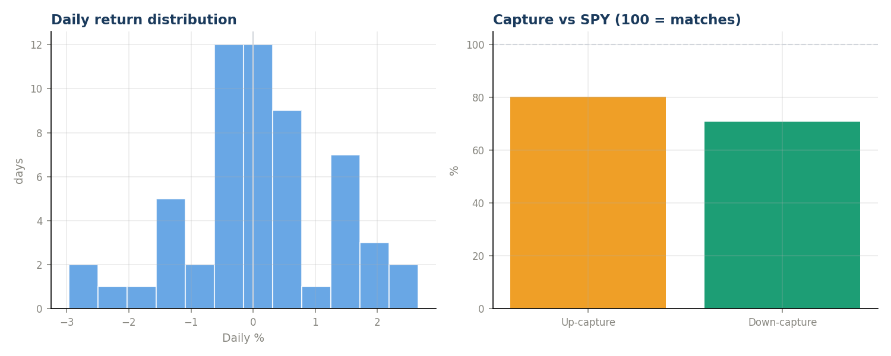
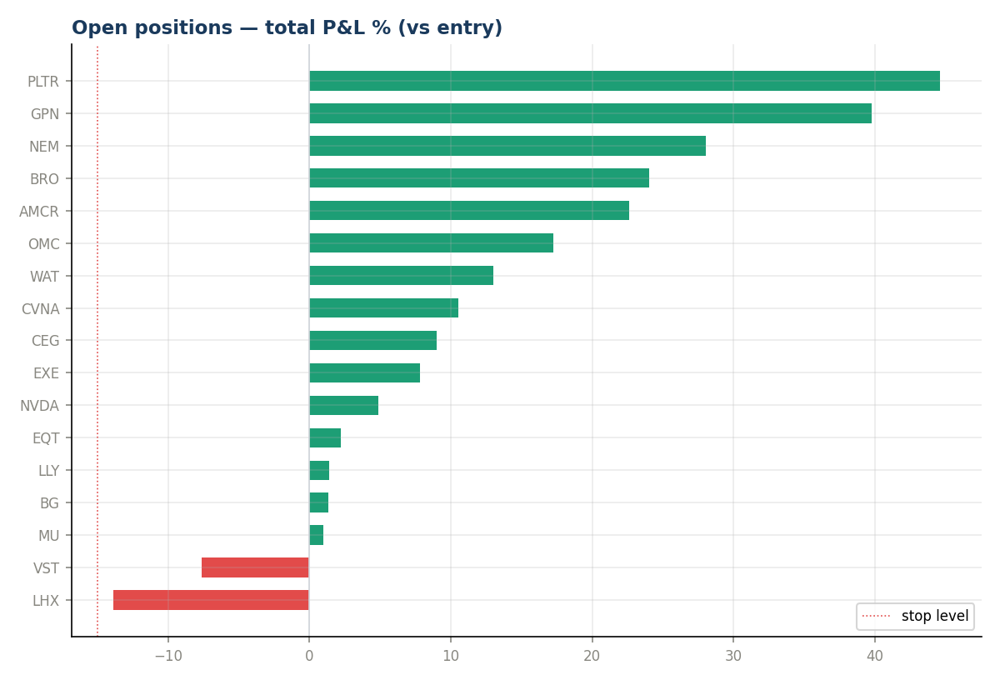
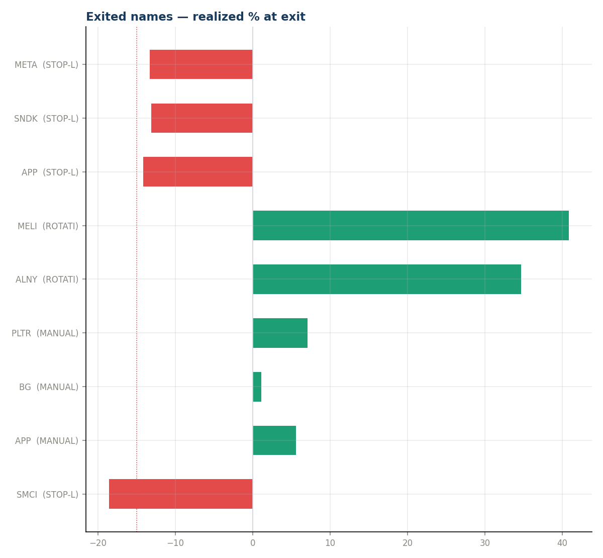
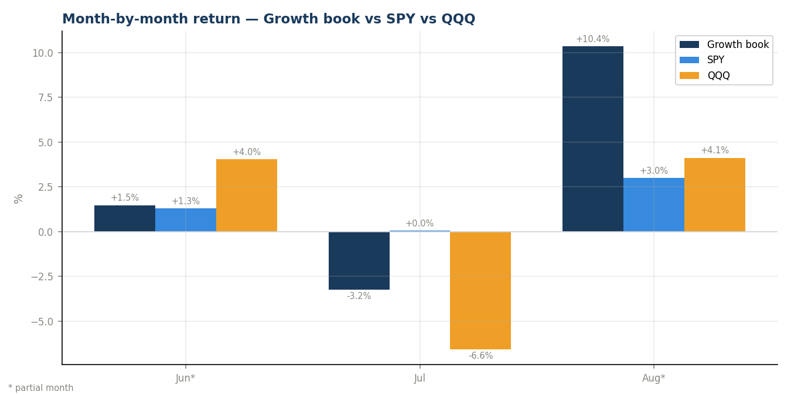

# ARIA-Growth — Month-End Review 2026-08

_Generated 2026-08-31 12:47. Read-only analysis; 57 trading days of data._

> **Sample-size caveat:** one month verifies the machinery and shows behavior; it cannot prove or disprove edge. Treat every number below as indicative, not conclusive.

## Headline
| Metric | Book | SPY | QQQ |
|---|---|---|---|
| Return since go-live | **+8.29%** | +4.37% | +1.21% |
| Alpha | — | +3.92pp | +7.08pp |

## Month-by-month
| Month | Days | Book | SPY | QQQ | vs SPY | vs QQQ |
|---|---|---|---|---|---|---|
| Jun 2026* | 16 | +1.48% | +1.29% | +4.04% | +0.19pp | -2.56pp |
| Jul 2026 | 21 | -3.24% | +0.05% | -6.57% | -3.29pp | +3.33pp |
| Aug 2026* | 20 | +10.35% | +3.00% | +4.13% | +7.35pp | +6.23pp |

_* partial month (first month is partial from go-live; the current month is partial too, through the latest logged row)._

## Risk-adjusted (annualized from daily)
- Sharpe: **1.18**   |   Sortino: **1.97**   |   Calmar: 4.65
- Ann. return +21.9%  |  Ann. vol 18.7%  |  Max drawdown -4.71%
- Beta vs SPY 0.83 (corr 0.57)
- Up-capture 80%  |  Down-capture 71%  ← winning by losing less
- Hit rate 52% (28W / 26L)  |  best day +2.66%  worst -2.97%

## Open book
- 17 positions, 15 in profit as of 2026-08-28
- Best: PLTR +44.6%  |  Worst: LHX -13.9%
- ⚠ Danger zone (<10pt to stop): LHX, VST

## Exits this period
| Name | Type | Exit date | Realized % |
|---|---|---|---|
| SMCI | STOP-LOSS | 2026-06-10 | -18.59% |
| APP | MANUAL DROP | 2026-06-15 | +5.57% |
| BG | MANUAL DROP | 2026-06-18 | +1.07% |
| PLTR | MANUAL DROP | 2026-06-23 | +7.05% |
| ALNY | ROTATION | 2026-07-10 | +34.70% |
| MELI | ROTATION | 2026-07-10 | +40.84% |
| APP | STOP-LOSS | 2026-07-13 | -14.19% |
| SNDK | STOP-LOSS | 2026-07-16 | -13.11% |
| META | STOP-LOSS | 2026-07-30 | -13.34% |

4 stop-loss, 3 manual. To grade whether each exit helped, compare the stock's current price to its level at exit (see exits_postmortem.png / px_now column if fetched).

## Charts

