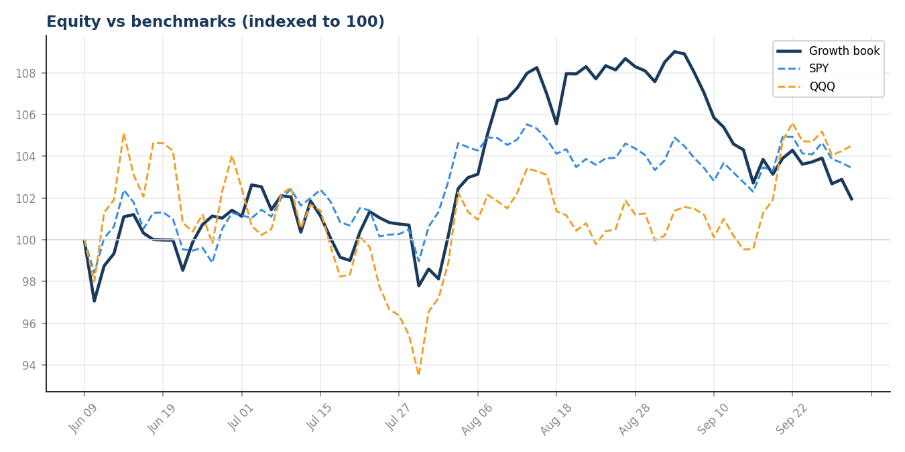
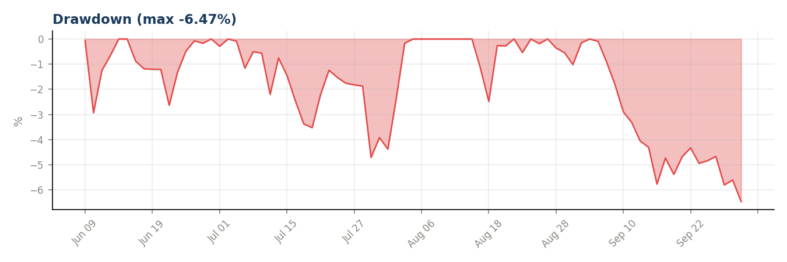
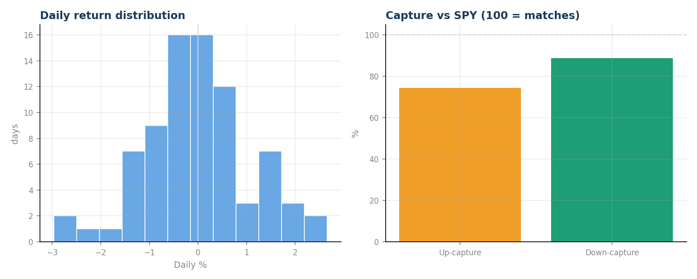
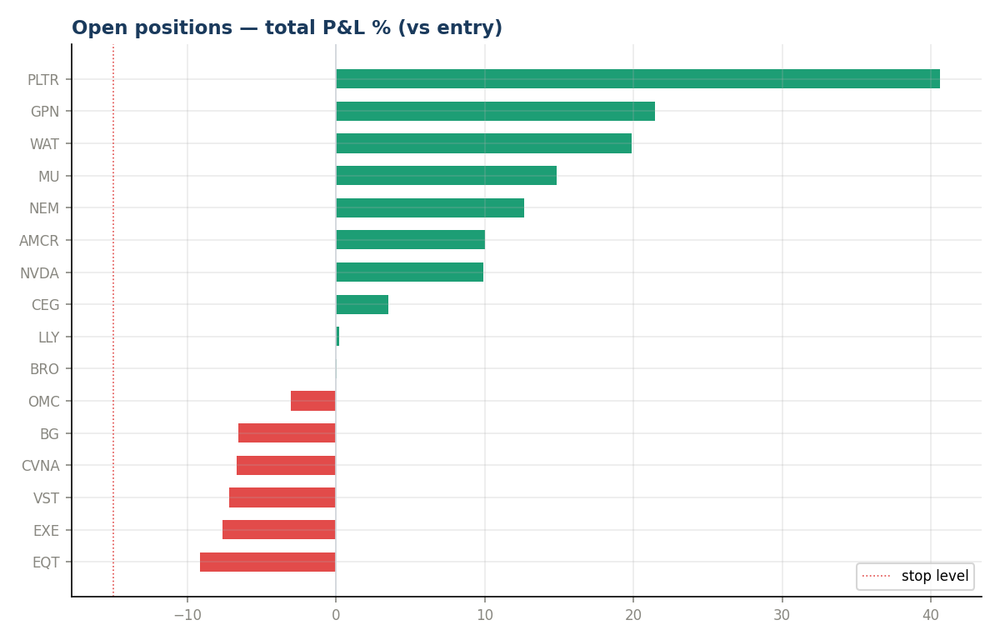
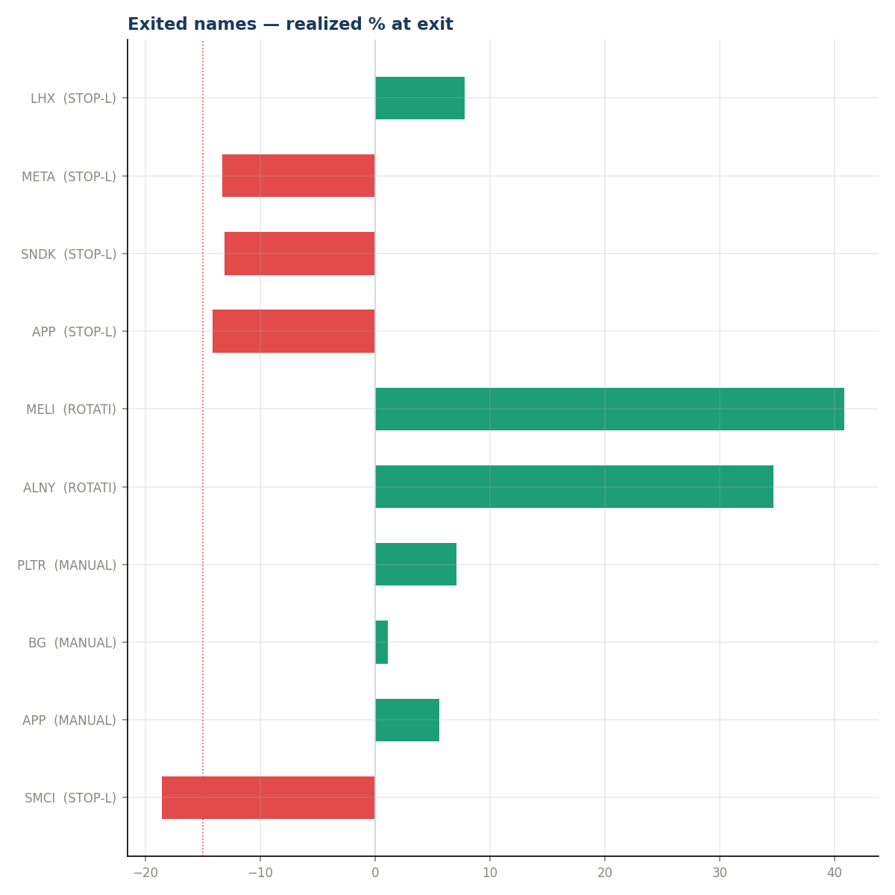
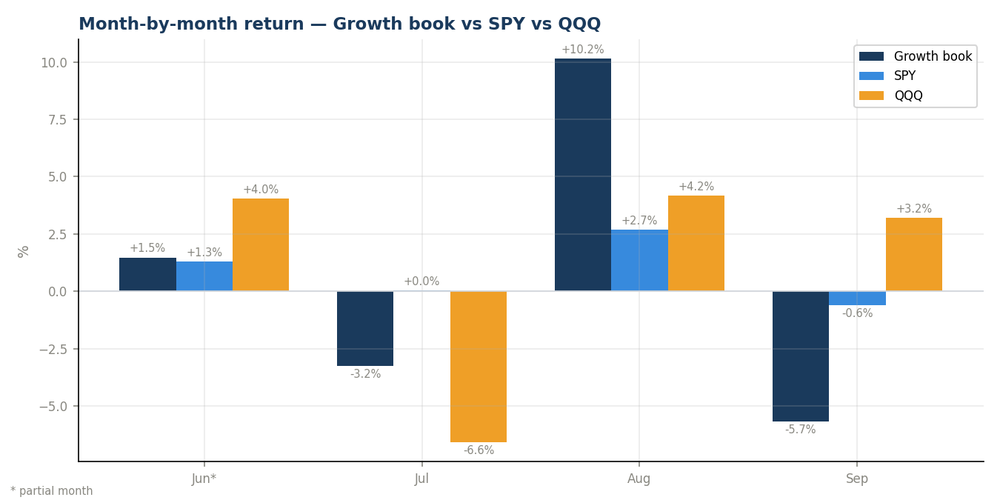

# ARIA-Growth — Month-End Review 2026-09

_Generated 2026-10-01 19:48. Read-only analysis; 79 trading days of data._

> **Sample-size caveat:** one month verifies the machinery and shows behavior; it cannot prove or disprove edge. Treat every number below as indicative, not conclusive.

## Headline
| Metric | Book | SPY | QQQ |
|---|---|---|---|
| Return since go-live | **+1.96%** | +3.44% | +4.51% |
| Alpha | — | -1.48pp | -2.55pp |

## Month-by-month
| Month | Days | Book | SPY | QQQ | vs SPY | vs QQQ |
|---|---|---|---|---|---|---|
| Jun 2026* | 16 | +1.42% | +1.28% | +4.04% | +0.14pp | -2.62pp |
| Jul 2026 | 21 | -3.24% | +0.05% | -6.57% | -3.29pp | +3.33pp |
| Aug 2026 | 21 | +10.15% | +2.69% | +4.18% | +7.46pp | +5.97pp |
| Sep 2026 | 21 | -5.68% | -0.60% | +3.21% | -5.08pp | -8.89pp |

_* partial month (first month is partial from go-live; the current month is partial too, through the latest logged row)._

## Risk-adjusted (over the 79 trading days — not annualized)
_Sharpe, Sortino, Calmar and volatility are measured over the 79 trading days actually traded (rf = 0), from daily returns chained off logged equity. The only annualized figure is **Ann. return**, an EXTRAPOLATION: the period return compounded to 252 trading days — a projection, not a measurement._

- Period return **+1.96%**  |  Period vol 9.13%  |  Max drawdown -6.47%
- Sharpe: **0.26**   |   Sortino: **0.37**   |   Calmar: 0.30
- Ann. return (extrapolated) +6.4%
- Beta vs SPY 0.92 (corr 0.69)
- Up-capture 83%  |  Down-capture 84%  
- Hit rate 46% (36W / 43L)  |  best day +2.28%  worst -2.89%

## Open book
- 16 positions, 10 in profit as of 2026-09-30
- Best: PLTR +40.6%  |  Worst: EQT -9.1%
- ⚠ Danger zone (<10pt to stop): EQT, EXE, VST, CVNA, BG

## Exits this period
| Name | Type | Exit date | Realized % |
|---|---|---|---|
| SMCI | STOP-LOSS | 2026-06-10 | -18.59% |
| APP | MANUAL DROP | 2026-06-15 | +5.57% |
| BG | MANUAL DROP | 2026-06-18 | +1.07% |
| PLTR | MANUAL DROP | 2026-06-23 | +7.05% |
| ALNY | ROTATION | 2026-07-10 | +34.70% |
| MELI | ROTATION | 2026-07-10 | +40.84% |
| APP | STOP-LOSS | 2026-07-13 | -14.19% |
| SNDK | STOP-LOSS | 2026-07-16 | -13.11% |
| META | STOP-LOSS | 2026-07-30 | -13.34% |
| LHX | STOP-LOSS | 2026-09-07 | +7.81% |

5 stop-loss, 3 manual. To grade whether each exit helped, compare the stock's current price to its level at exit (see exits_postmortem.png / px_now column if fetched).

## Charts

