# Virtual Trading Firm — Documentation Index

**Project:** Virtual Trading Firm  
**Repository root:** `D:\__A Google Drive Project\virtual_trading_firm\`  
**Last updated:** April 2026

---

## Contents

| File                        | Section                         | Status                |
| --------------------------- | ------------------------------- | --------------------- |
| `01_core_infrastructure.md` | 1. Core Infrastructure Setup    | Complete              |
| `02_agent_architecture.md`  | 2. Agent Architecture           | Complete (superseded) |
| `03_market_data_layer.md`   | 3. Market Data Layer            | Complete              |
| `04_signal_generation.md`   | 4. Signal Generation            | Complete              |
| `05_backtesting.md`         | 5. Backtesting Engine           | Complete              |
| `06_rl_agent.md`            | 6. Reinforcement Learning Agent | Ongoing               |
| `07_explainer.md`           | 7. Groq Explainer               | Ongoing               |

---

## System Architecture Flowchart

```mermaid
flowchart TB
    subgraph INFRA["🏗️ Infrastructure"]
        A1["venv (D: drive)"] --> A2["Google Drive sync"]
        A1 --> A3["Colab GPU bridge"]
        A4["TradingAgents cloned<br/>Groq patched into llm_clients"]
    end

    subgraph DATA["📊 Market Data Layer"]
        B1["local_indicators.py<br/>pandas-ta indicators"]
        B2["finbert_sentiment.py<br/>FinBERT + NewsAPI/RSS"]
        B3["kalman_risk.py<br/>Dynamic stop-loss"]
        B4["advanced_price_features.py<br/>RWI · OU · QV · D/D · HJB"]
    end

    subgraph FEATURES["🔧 Feature Engineering"]
        C1["feature_builder.py<br/>OHLCV + technical + fundamental"]
    end

    subgraph SIGNALS["⚡ Signal Generation"]
        D1["rc_temporal.py<br/>Echo State Network"]
        D2["xgboost_model.py<br/>6 tickers · Triple Barrier<br/>Optuna · SHAP"]
        D3["signal_engine.py<br/>Orchestrator + sentiment overlay<br/>RL state vector"]
    end

    subgraph BACKTEST["📈 Backtesting Engine"]
        F1["backtest_engine_v2.py<br/>Walk-forward · Regime detection<br/>Kalman ensemble · Filter competition<br/>Champion selection · Kill-switch<br/>Window quality weighting"]
        F2["portfolio.py<br/>Position tracking · Equity curve<br/>Drawdown · Slippage"]
        F3["metrics.py<br/>Sharpe · Sortino · Calmar · Omega<br/>VaR · CVaR · Per-regime breakdown<br/>5-panel tearsheet · RL features"]
        F4["scheduler.py<br/>Monthly auto-retrain<br/>Daily explainer scheduling"]
    end

    subgraph RL["🧠 Reinforcement Learning"]
        E1["rl_agent.py<br/>SAC + GRU policy<br/>50-feature state<br/>Sortino/Sharpe reward"]
        E2["benchmark.py<br/>SAC vs PPO vs A2C vs TD3"]
        E3["Training: Colab T4 GPU<br/>~2.5h · 500k timesteps"]
        E4["Inference: CPU<br/>best_model/best_model.zip"]
    end

    subgraph EXPLAINER["📝 Groq Explainer"]
        G1["groq_explainer.py<br/>Daily briefing · Trade audit<br/>Regime warning · Weekly summary<br/>Data freshness · Signal quality<br/>Model fallback chain"]
    end

    %% Flow connections (corrected order)
    INFRA --> DATA
    DATA --> FEATURES
    FEATURES --> SIGNALS
    SIGNALS --> BACKTEST
    BACKTEST --> RL
    RL --> EXPLAINER
    SIGNALS -.->|"state vector only"| RL

    %% Styling
    style INFRA fill:#1a1a2e,stroke:#16213e,color:#eee
    style DATA fill:#0f3460,stroke:#16213e,color:#eee
    style FEATURES fill:#533483,stroke:#16213e,color:#eee
    style SIGNALS fill:#e94560,stroke:#16213e,color:#fff
    style BACKTEST fill:#2c3e50,stroke:#16213e,color:#eee
    style RL fill:#0b8457,stroke:#16213e,color:#eee
    style EXPLAINER fill:#6c3483,stroke:#16213e,color:#eee
```



# System Architecture

| Layer                      | Components                                                                         |
| -------------------------- | ---------------------------------------------------------------------------------- |
| **Infrastructure**         | venv + Google Drive + Colab GPU + Groq-patched TradingAgents                       |
| **Market Data**            | pandas-ta + FinBERT sentiment + Kalman risk + advanced features (RWI, OU, QV, HJB) |
| **Signal Gen**             | Echo State Network + XGBoost (Optuna/SHAP) + sentiment overlay                     |
| **Backtesting**            | Walk-forward, regime detection, Kalman ensemble, champion selection, kill-switch   |
| **Reinforcement Learning** | SAC + GRU (50-feature state), trained on T4 GPU, inference on CPU                  |
| **Explainer**              | Groq-powered daily briefings, trade audits, regime warnings, model fallback        |

## System Architecture (Detailed)

```
Section 1: Infrastructure
    venv (drive) + Google Drive sync + Colab GPU bridge
    TradingAgents cloned, Groq patched into llm_clients

Section 2: Agent Architecture (superseded)
    TradingAgents multi-agent framework confirmed functional
    Replaced by ML pipeline due to Groq token limits

Section 3: Market Data Layer
    local_indicators.py         pandas-ta technical indicators (local)
    finbert_sentiment.py        FinBERT sentiment, NewsAPI + RSS fallback
    kalman_risk.py              dynamic stop-loss via Kalman filter
    advanced_price_features.py  RWI, OU mean-reversion, QV, D/D ratio, HJB

Section 4: Signal Generation
    feature_builder.py          OHLCV + technical + fundamental feature matrix
    rc_temporal.py              Echo State Network temporal patterns
    xgboost_model.py            global brain: 6 tickers, Triple Barrier, Optuna, SHAP
    signal_engine.py            orchestrator + sentiment overlay + RL state vector

Section 5: Backtesting Engine
    backtest_engine_v2.py       walk-forward, regime detection, Kalman ensemble,
                                filter competition, champion selection, kill-switch,
                                window quality weighting, regime-aware sizing
    portfolio.py                position tracking, equity curve, drawdown, slippage
    metrics.py                  Sharpe, Sortino, Calmar, Omega, VaR, CVaR,
                                per-regime breakdown, per-window breakdown,
                                RL feature export, 5-panel tearsheet
    scheduler.py                monthly auto-retrain + daily explainer scheduling

Section 6: Reinforcement Learning Agent
    rl_agent.py                 SAC + GRU policy, 50-feature state space,
                                Sortino/Sharpe hybrid reward, step_every=5
    benchmark.py                SAC vs PPO vs A2C vs TD3 side-by-side comparison
    Training: Colab T4 GPU (~2.5 hour per run, 500k timesteps)
    Inference: CPU, loaded from best_model/best_model.zip

Section 7: Groq Explainer
    groq_explainer.py           daily briefing, trade audit, regime warning,
                                weekly summary, data freshness tracking,
                                signal quality labels, model fallback chain

Section 8: Documentation
    This folder
```

---

## Performance Summary

Results from most recent full run (2021-01-04 to 2025-03-28, 1,544 trading days).

| Metric               | Backtest | RL Agent OOS |
| -------------------- | -------- | ------------ |
| Total return         | 78.8%    | 21.72%       |
| Annualised return    | 14.74%   | 39.75%       |
| Sharpe               | 1.342    | 1.348        |
| Sortino              | 2.155    | 2.301        |
| Calmar               | 1.067    | 2.562        |
| Max drawdown         | -13.82%  | -15.51%      |
| Win rate             | 80.2%    | —            |
| Bull-Trending Sharpe | 2.916    | —            |
| Bear-Trending Sharpe | 2.065    | —            |

---

## Key Design Decisions

**Groq as explainer only.**
Groq was originally intended as the core reasoning engine. During development, the free tier limit of 100,000 tokens per day was consumed in a single multi-ticker training run. The architecture was redesigned so that all signal generation, regime detection, and portfolio allocation are performed by local ML models. Groq is reserved exclusively for plain-English explanation of upstream decisions, consuming approximately 300 tokens per ticker per day.

**Local-first ML.**
Every model in the signal pipeline — pandas-ta, FinBERT, ESN, XGBoost — runs locally with no GPU requirement. The only component requiring GPU is the RL agent, which is trained on Colab T4 and loaded for CPU inference in production.

**Sentiment in training vs inference.**
All training data uses `sentiment = 0.0`. Real FinBERT scores are applied as a post-prediction overlay at inference time only. This design eliminates future data leakage from NewsAPI's 30-day article window while still incorporating sentiment for live trading.

**Triple Barrier labels.**
Standard binary labels (price up in N days) are noisy and produce unbalanced classes. Triple Barrier labels use ATR-scaled barriers (1.1x profit / 1.0x stop) to assign labels only when price makes a meaningful move, improving label quality and class balance.

**Walk-forward validation.**
All XGBoost evaluation uses walk-forward cross-validation with expanding windows. Standard k-fold CV is not used because it allows future data to contaminate earlier training windows, producing optimistic performance estimates.

**Kill-switch.**
The system halts new trade execution when the 20-bar rolling Sharpe drops below -1.25, drawdown exceeds 4%, and the Sharpe slope is negative simultaneously. The triple condition prevents false positives from brief volatility spikes. Equity recording and resume evaluation continue unconditionally every bar so the system can exit the halt state as conditions improve.

**Sortino over Sharpe as primary metric.**
Sharpe penalises upside volatility equally with downside. Given the strategy's asymmetric return profile (high win rate, occasional large winners), Sortino more accurately reflects risk-adjusted quality. The RL reward function weights Sortino at 70% and Sharpe at 30%.

**RL frequency alignment.**
The XGBoost model is trained on 5-day forward returns. To align the RL agent's decision frequency with the signal horizon, the environment rebalances every 5 bars (step_every=5) rather than daily. This prevents the agent from acting on daily noise that the signal was not designed to capture.

**Walk-forward window quality.**
Signal reliability varies across walk-forward windows. Recent windows that performed well receive higher blending weight via sigmoid(window_sharpe) \* recency_decay(0.9^n), clamped to [0.3, 1.0]. This adds memory to the blending system and reduces overfit to any single market period.

---

## Monthly Maintenance

The system is designed for low-maintenance operation. The scheduler handles most tasks automatically.

| Task                       | Who               | When                   | Duration    |
| -------------------------- | ----------------- | ---------------------- | ----------- |
| Backtest retrain (XGBoost) | scheduler.py auto | 1st of month, 02:00    | ~8 hours    |
| RL agent retrain           | Manual, Colab T4  | After backtest retrain | ~3 hour     |
| Daily metrics refresh      | scheduler.py auto | Weekdays, 17:30        | ~30 seconds |
| Daily Groq explainer       | scheduler.py auto | Weekdays, 18:00        | ~2 minutes  |

After each backtest retrain, `scheduler.py` writes a reminder to `logs/COLAB_RETRAIN_NEEDED_DATE.txt`. Open Colab, run RL training cells, delete the reminder file.

---

## Known Issues Across Sections

| Issue                                                                   | Section | Status                                 |
| ----------------------------------------------------------------------- | ------- | -------------------------------------- |
| Drift AUC reaches 1.0 after 6+ months without retraining                | 5, 7    | Managed by monthly scheduler           |
| FinBERT returns identical sentiment for all tickers in some sessions    | 3, 7    | Under investigation                    |
| Bull-MeanRev and Bear-MeanRev return None in champion selection         | 5       | Insufficient trades in those regimes   |
| RL must be retrained on Colab T4 manually                               | 6       | By design, no local GPU                |
| Portfolio equity in explainer reflects last RL training date, not today | 7       | Live portfolio tracker not yet built   |
| COVID crash and 2018 Q4 stress tests return NaN                         | 5       | Outside date range of current backtest |
